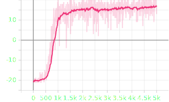
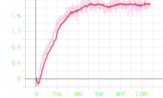
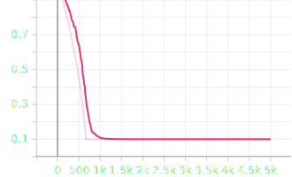

# Atari Deep Q-Network

This project implements a Deep Q-Network (DQN) agent capable of learning to play Atari games, specifically Pong, using the Gymnasium environment and PyTorch. This is my personal implementation of the DQN algorithm introduced in the paper [Playing Atari with Deep Reinforcement Learning](https://arxiv.org/abs/1312.5602) by Volodymyr Mnih et al.

## Demo Video

Watch the DQN agent play Pong! 
See the video in the `videos` folder.

<video width="640" height="360" controls autoplay loop muted playsinline>
  <source src="videos/eval.mp4" type="video/mp4">
  Your browser does not support the video tag.
</video>


## Project Structure

- `dqn/`: Contains the implementation of the DQN agent, replay buffer, and environment wrappers.
- `best_run/`: Stores the best model checkpoint and training metrics.
- `main.py`: The entry point for training and evaluating the agent.
- `training_config.yml`: Configuration file for training hyperparameters.

## Installation

Ensure you have Python 3.13+ installed.

This project uses `uv` for dependency management, but you can also install dependencies using pip.

### Using pip

```bash
pip install click "gymnasium[atari,other]" matplotlib numpy pyyaml tensorboard torch torchvision
```

### Using uv

```bash
uv sync
```

## Usage

The `main.py` script provides a Command Line Interface (CLI) for training and evaluation.

### Training

To train the agent using the configuration in `training_config.yml`:

```bash
python main.py --train --config training_config.yml
```

### Evaluation

To evaluate the pre-trained model (best run):

```bash
python main.py --eval --checkpoint best_run/dqn_pong_5000.pth --episodes 10
```

**Options:**

- `--train` / `--no-train`: Run the training loop.
- `--eval` / `--no-eval`: Run evaluation.
- `--render-human`: Render the game in a window (human mode). Note: Video recording is disabled in this mode.
- `--create-video`: Create a video of the evaluation (saved to `videos/`).
- `--config`: Path to the training configuration YAML file.
- `--checkpoint`: Path to the model checkpoint for evaluation.
- `--env`: Gym environment ID to use (default: `ALE/Pong-v5`).
- `--episodes`: Number of episodes for evaluation.

## Results

The following charts visualize the training progress from the best run. The training stopped at 5000 episodes achieving an average reward of 19.5. The agent was able to learn to play Pong and achieve a high score. The training configuration is stored in `training_config.yml`.

### Reward during Training


### Loss during Training


### Mean Q-Values


### Exploration Rate (Epsilon)

